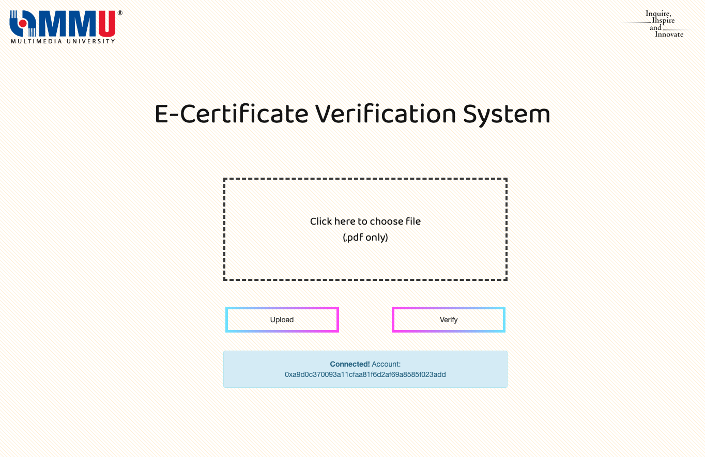
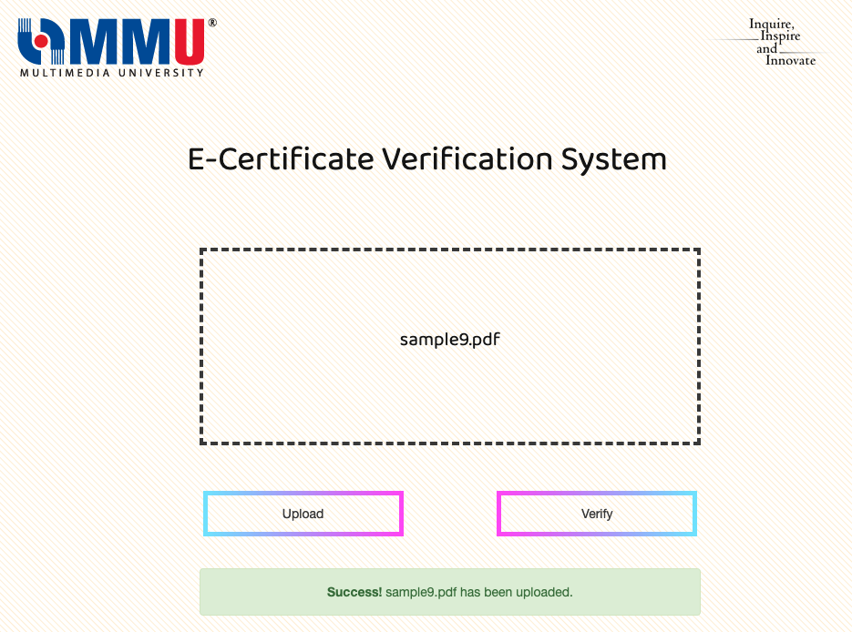

# my_FYP

Digital Certificate Verification System Utilizing Permissioned Blockchain

A certificate verification system using blockchain is nothing new. However, most rely on public, permissionless blockchain networks where the processing time and transaction fee vary wildly. With a permissioned blockchain network, processing time is more consistent, and it allows for the system owner to set the transaction fee to be zero, thereby making the system more feasible.

## Sample Screenshot

Main landing page should account be reachable. If account is locked, upload button will be disabled, and an error message would show up instead. If MetaMask isn't installed, upload button is removed entirely.

Firstly, a file should be selected to upload. Only PDFs are allowed, and up to ten files can be selected at once. This is the same for file verification as well. Success messages for both buttons are a compilation. An example is shown below. Error messages are displayed one for each file. This makes troubleshooting easier.

## Set-up Guide

### Pre-requisites

1. Ganache GUI (or any valid alternative).
1. [npm](https://www.npmjs.com/get-npm) (to install http-server, Truffle and CryptoJS).
1. http-server: `npm install http-server -g`
1. Truffle: `npm install truffle -g`
1. CryptoJS (for hashing input file): `npm install crypto-js -g`

### Smart contracts (if edited)

1. cd into project folder, then execute `truffle compile`
1. Open project_folder/build/contracts/certificate.json
1. Copy values for _abi_.
1. Open project_folder/web_page/here.js
1. Replace _abi_ values with what was copied.

### Blockchain network

1. In Ganache, click on _New Workspace_ (Ethereum).
1. Under _Chain_, set _Gas Price_ and _Gas Limit_ to be _0_. Everything else can be left at their default values.
1. Click on _Save Workspace_ at the top right.
1. Copy _Network ID_ and _RPC Server_. Usually these values are _5777_ and *http://127.0.0.1:7545*
1. Under the _Account_ tab, copy any account's public address.
1. Open project_folder/truffle.js
1. Replace values for _host_, _port_, _network ID_ and _from_ with what was copied.
1. cd into project folder, and execute `truffle migrate`
1. In the output, copy _contract address_ for certificate.sol.
1. Open project*folder/web_page/here.js, and replace value for \_address* variable (line 3) with what was copied.

### Metamask

1. Under _Networks_, click on _Add Network_.
1. Give it a name (can be anything you want).
1. RPC URL is the RPC Server inside Ganache.
1. For _Chain ID_, there currently is no way to get it from Ganache GUI. So, enter a random number, and click _Save_. Then, a message would pop-up giving you the proper Chain ID to input.
1. Leave everything else blank, and click _Save_.
1. Click on the icon in the blue ring, and select _Import Account_.
1. In Ganache GUI, under the _Accounts_ tab, under any account, click on the key icon at the right.
1. Copy the _Private Key_ and paste into MetaMask.

### Web page

1. cd to project_folder/web_page
1. Execute command: `http-server .` (a full-stop at the end)
1. In a web-browser, enter the url: _localhost:8080_
1. Upload and verify documents.

### Testing

1. To test the smart contracts, first cd into the project folder.
1. Then setup a development network: `truffle development`
1. Finally, run the test script with `test`

    1. The first test tries to find the given hash value in the network. It will return a null value.
    1. The second block uploads the given hash value, before the previous test is run again. This time, it will return a non-null value.

Note: this test will only work the first time it is run. For subsequent runs, alter the hash values in \test\test.js. All hash values need to be identical.
