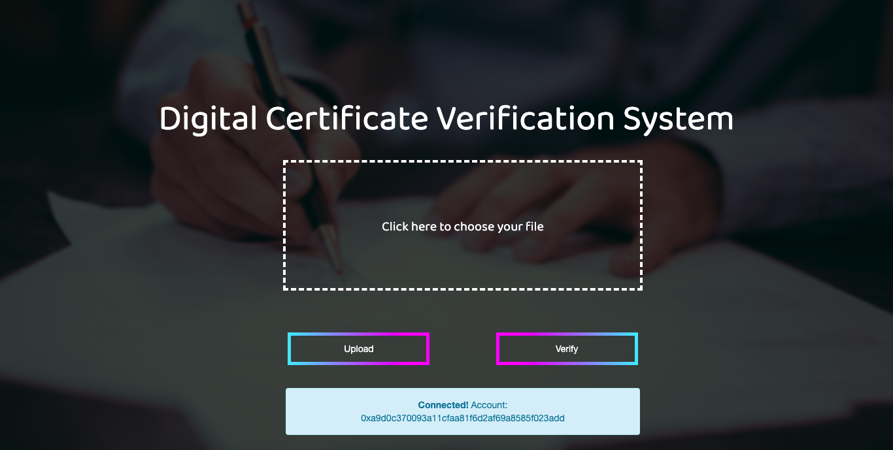
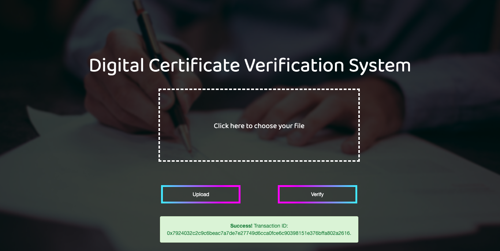
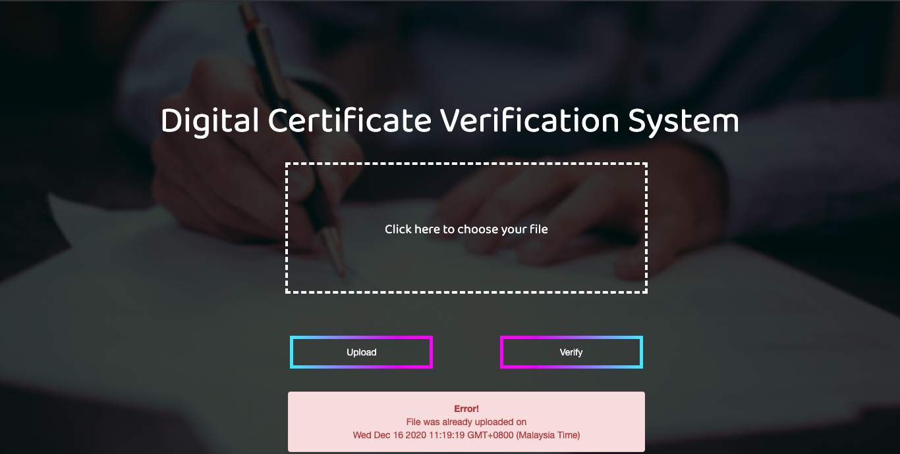

# my_FYP
Digital Certificate Verification System Utilizing Permissioned Blockchain

## Sample Screenshot

Main landing page should account be reachable. 

After uploading a file, an alert box will pop-up with the Transaction ID. 

If input file has already been uploaded, an alert box pops up to remind user of the situation. 

## Set-up Guide

### Pre-requisites
1. Ganache GUI (or any valid alternative).
1. [npm](https://www.npmjs.com/get-npm) (to install http-server, Truffle and CryptoJS).
1. http-server: `npm install http-server -g`
1. Truffle: `npm install truffle -g`
1. CryptoJS (for hashing input file): `npm install crypto-js -g`

### Smart contracts (if edited)
1. cd into project folder, then execute `truffle compile`
1. Open project_folder/build/contracts/certificate.json
1. Copy values for *abi*.
1. Open project_folder/web_page/here.js
1. Replace *abi* values with what was copied.

### Blockchain network
1. In Ganache, click on *New Workspace* (Ethereum).
1. Under *Chain*, set *Gas Price* and *Gas Limit* to be *0*. Everything else can be left at their default values.
1. Click on *Save Workspace* at the top right.
1. Copy *Network ID* and *RPC Server*. Usually these values are *5777* and *http://127.0.0.1:7545*
1. Under the *Account* tab, copy any account's public address.
1. Open project_folder/truffle.js
1. Replace values for *host*, *port*, *network ID* and *from* with what was copied.
1. cd into project folder, and execute `truffle migrate`
1. In the output, copy *contract address* for certificate.sol.
1. Open project_folder/web_page/here.js, and replace value for *address* variable (line 3) with what was copied.

### Metamask
1. Under *Networks*, click on *Add Network*.
1. Give it a name (can be anything you want).
1. RPC URL is the RPC Server inside Ganache.
1. For *Chain ID*, there currently is no way to get it from Ganache GUI. So, enter a random number, and click *Save*. Then, a message would pop-up giving you the proper Chain ID to input.
1. Leave everything else blank, and click *Save*.
1. Click on the icon in the blue ring, and select *Import Account*.
1. In Ganache GUI, under the *Accounts* tab, under any account, click on the key icon at the right.
1. Copy the *Private Key* and paste into MetaMask.

### Web page
1. cd to project_folder/web_page
1. Execute command: `http-server .` (a full-stop at the end)
1. In a web-browser, enter the url: *localhost:8080*
1. Upload and verify documents.
